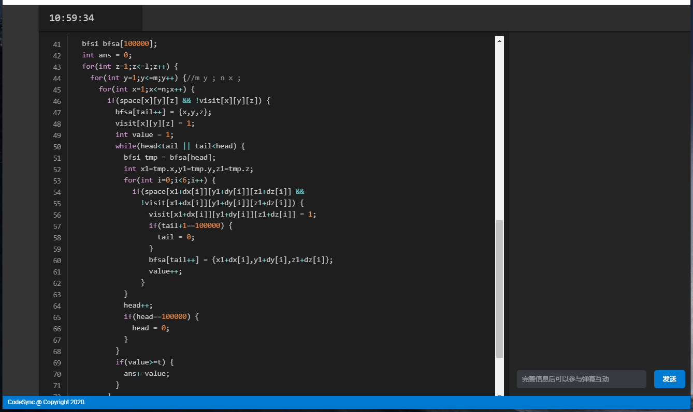
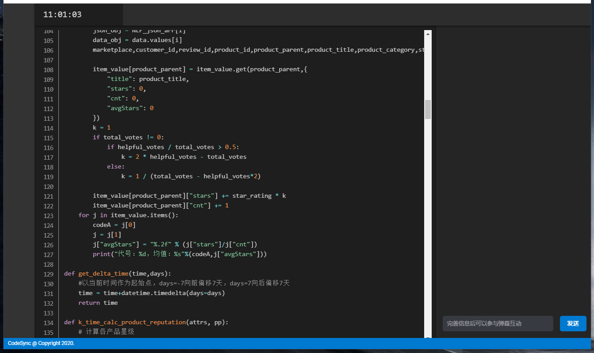

[CodeSync博文地址（更详细的介绍）](https://puluter.cn/20201022/codesync/)

# 作品简介

CodeSync旨在解决传统程序开发授课时，因投影仪质量不佳导致学生无法看清教师vscode中的示例代码的问题。

我们开发了一个vscode插件，当vscode内代码出现变化时，利用声网提供的RTM服务进行代码同步，在网页端即可以收到消息，同时我们也额外开发了弹幕功能用于课上的师生交流。

小巧精悍，好用合理。


# 快速启动
## 配置
- /codesync-web/.env
- /codesync-plugin/src/view/index.html:51,52 agora appid&channel_name
- /codesync-plugin/src/view/index.html:101 frontend page url
- /codesync-plugin/src/view/lib/yes3.js:16 backend url(yesapi的php代理网址)
- /codesync-plugin/frt/index.html:30,31 agora appid&channel_name
- /codesync-plugin/src/view/lib/yes3.js:16 backend url(yesapi的php代理网址)
## 启动(插件)
1. ``` $ npm i```
2. ``` $ vsce package ``` 或者进入```/src/extension.js```按F5选最后一个调试
3. ``` $ cd codesync-web & npm i```
4. ``` $ npm run-script serve ```

# 示意图

网页主界面：

C++的代码同步Demo：

Python的代码同步Demo:



# 项目成员
王嘉维 Joel
于卓浩 Puluter

